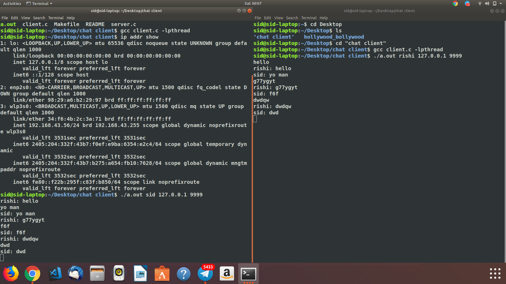

# Termix
A chatting client based on Socket.h in Linux terminal
___
## Terminal Commands
Step 1: `git clone https://github.com/codekhal/Termix.git`  
Step 2: `cd Termix`  
Step 3: `gcc server.c -lpthread`  
Step 4: `./a.out`  

**(ON Another TERMINAL)**    
Step 1: `cd Termix`  
Step 2: `gcc client.c -lpthread`  
Step 3: `./a.out user1 hostIp 9999`  

**(ON Second Another TERMINAL)**    
Step 1: `cd Termix`  
Step 2: `gcc client.c -lpthread`  
Step 3: `./a.out user2 hostIp 9999`  
___
## SCREENSHOT

